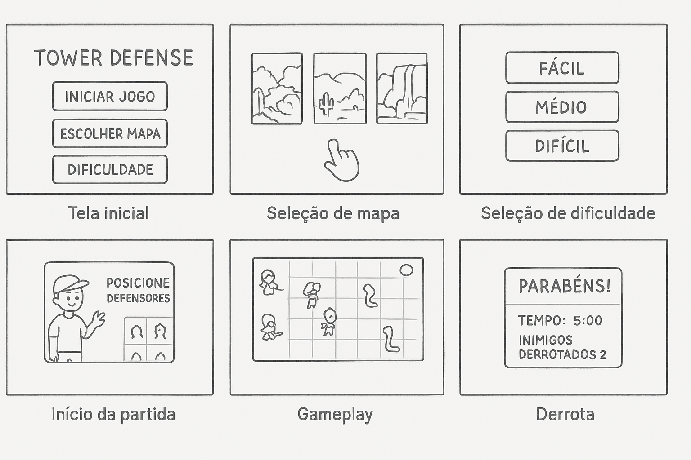

# 1.1. Módulo Design Sprint

Usando a lista de projetos indicados por grupo para o período letivo vigente, realizar Design Sprint para levantamento dos requisitos.

Foco_1: Desing Sprint

Entrega Mínima: Design Sprint, evidenciando cada uma das 5 ETAPAS.
Apresentação (para a professora) explicando passo a passo a Design Sprint realizada, com: (i) rastro claro aos membros participantes (MOSTRAR QUADRO DE PARTICIPAÇÕES & COMMITS); (ii) justificativas & senso crítico sobre o trabalho realizado, e (iii) comentários gerais sobre o trabalho em equipe. Tempo da Apresentação: +/- 5min. Recomendação: Apresentar diretamente via Wiki ou GitPages do Projeto. Baixar os conteúdos com antecedência, evitando problemas de internet no momento de exposição nas Dinâmicas de Avaliação.

A Wiki ou GitPages do Projeto deve conter um tópico dedicado ao Módulo Design Sprint, com as etapas da Design Sprint documentadas, histórico de versões, referências, e demais detalhamentos gerados pela equipe nesse escopo.
Demais orientações disponíveis nas Diretrizes (vide Aprender3).

# Design Sprint

## Introdução

O *Design Sprint* é uma metodologia ágil de cinco dias criada pelo Google Ventures para acelerar o processo de validação de ideias e solução de problemas complexos através de prototipagem e testes com usuários reais<a id="anchor_1" href="#REF1">^1^</a>. Esta abordagem permite que equipes multidisciplinares colaborem de forma estruturada para desenvolver, prototipar e testar soluções inovadoras em um curto período de tempo. O objetivo principal é reduzir riscos e incertezas antes de investir recursos significativos no desenvolvimento de um produto ou funcionalidade.

## Metodologia

A metodologia do Design Sprint foi aplicada pelo nosso grupo seguindo as cinco etapas fundamentais da metodologia original. Durante o processo, todos os participantes do grupo colaboraram ativamente em cada fase, conforme documentado em [*Participantes*](#participantes). As etapas incluem: **Mapear** (compreensão do problema), **Esboçar** (geração de ideias), **Decidir** (seleção da melhor solução), **Prototipar** (criação de um protótipo) e **Testar** (validação com usuários). Cada etapa foi cuidadosamente planejada e executada para garantir o máximo aproveitamento do tempo e a geração de insights valiosos para o desenvolvimento do projeto.

## Participantes

<strong>Tabela 2: Cronograma de Participantes</strong>

<table>
  <thead>
    <tr>
      <th>Nome</th>
      <th>Função</th>
      <th>Data</th>
      <th>Hora</th>
    </tr>
  </thead>
  <tbody>
    <tr>
      <td><a href="https://github.com/caioduart3">Caio Duarte</a></td>
      <td>Elaboração do Design Sprint</td>
      <td>-</td>
      <td>-</td>
    </tr>
    <tr>
      <td><a href="https://github.com/danielle-soaress">Danielle Soares</a></td>
      <td>Elaboração do Design Sprint</td>
      <td>-</td>
      <td>-</td>
    </tr>
    <tr>
      <td><a href="https://github.com/EnzoEmir">Enzo Emir</a></td>
      <td>Elaboração do Design Sprint</td>
      <td>-</td>
      <td>-</td>
    </tr>
    <tr>
      <td><a href="https://github.com/felixlaryssa">Laryssa Félix</a></td>
      <td>Elaboração do Design Sprint</td>
      <td>-</td>
      <td>-</td>
    </tr>
    <tr>
      <td><a href="https://github.com/Leticia-Arisa-K-Higa">Leticia Arisa</a></td>
      <td>Elaboração do Design Sprint</td>
      <td>-</td>
      <td>-</td>
    </tr>
    <tr>
      <td><a href="https://github.com/MM4k">Marcelo Makoto</a></td>
      <td>Elaboração do Design Sprint</td>
      <td>-</td>
      <td>-</td>
    </tr>
    <tr>
      <td><a href="https://github.com/dudaa28">Maria Eduarda</a></td>
      <td>Elaboração do Design Sprint</td>
      <td>-</td>
      <td>-</td>
    </tr>
    <tr>
      <td><a href="https://github.com/RafaelSchadt">Rafael Welz</a></td>
      <td>Elaboração do Design Sprint</td>
      <td>-</td>
      <td>-</td>
    </tr>
    <tr>
      <td><a href="https://github.com/VictorPontual">Victor Pontual</a></td>
      <td>Elaboração do Design Sprint</td>
      <td>-</td>
      <td>-</td>
    </tr>
  </tbody>
</table>

## Unpack

## Sketch

### 5W2H

O 5W2H é uma ferramenta de gestão e planejamento usada para organizar ideias, estruturar ações e criar planos de forma simples e prática.
O nome vem das iniciais em inglês das perguntas que devem ser respondidas:

??? note "What (O quê)?"
    Desenvolver um jogo estilo Tower defense para desktop com a temática mitologia brasileira
    
??? note "Why (Por quê)?"
    Para informar e motivar as pessoas a conhecerem mais da cultura brasileira

??? note "Where (Onde)?"
    Para desktop com Pygame, não é necessário acesso a internet para jogar.

??? note "When (Quando)?"
    Início do desenvolvimento em março de 2025 até julho de 2025

??? note "Who (Quem)?"
    
    Equipe do Projeto: 
    <table align="center">
      <tr>
        <td align="center">
           
          <b><a href="https://github.com/caioduart3">Caio Duarte</a></b> 
        </td>
        <td align="center">
           
          <b><a href="https://github.com/danielle-soaress">Danielle Soares</a></b> 
        </td>
        <td align="center">
           
          <b><a href="https://github.com/EnzoEmir">Enzo Emir</a></b> 
        </td>
        <td align="center">
           
          <b><a href="https://github.com/felixlaryssa">Laryssa Félix</a></b> 
        </td>
        <td align="center">
           
          <b><a href="https://github.com/Leticia-Arisa-K-Higa">Leticia Arisa</a></b> 
        </td>
        <td align="center">
           
          <b><a href="https://github.com/MM4k">Marcelo Makoto</a></b> 
        </td>
      </tr>
      <tr>
        <td align="center">
           
          <b><a href="https://github.com/dudaa28">Maria Eduarda</a></b> 
        </td>
        <td align="center">
           
          <b><a href="https://github.com/VictorPontual">Victor Pontual</a></b> 
        </td>
        <td align="center">
           
          <b><a href="https://github.com/RafaelSchadt">Rafael Welz</a></b> 
        </td>
      </tr>
    </table>

    Público-alvo: Pessoas interessadas em jogos estilos tower defense (Ex: Plants vs Zombie).

??? note "How (Como)?"
    Com pesquisa e ánalise de jogos já existentes na área, planejamento para as principais funcionalidades: Inicar jogo, pausar, escolher mapa, escolher dificuldade, entre outras.
    Utilizando a biblioteca Pygame para desenvolver o jogo com python, utilizando também github para versionar o trabalho e mkdocs para documentar a arquitetura e desenho
    utilizando de metodologias ágeis para desenvolvimento

??? note "How much (Quanto)?"
    A princípio o objetivo é que todo o projeto não tenha custos financeiros.

Fonte: [Caio Duarte](https://github.com/caioduart3), [Rafael Schadt](https://github.com/rafaelschadt), 2025.

## Decision

### Storyboard

O storyboard é uma representação visual das principais etapas e interações do usuário com o jogo, permitindo antecipar o fluxo da experiência e validar ideias de design antes do desenvolvimento do protótipo. Ele auxilia a equipe a alinhar expectativas, identificar possíveis melhorias e comunicar de forma clara como será a jornada do jogador.

  
   
  
Fonte: <a href="https://github.com/caioduart3">Caio Duarte</a>, <a href="https://github.com/MM4k">Marcelo Makoto</a>, 2025.

## Prototype

## Test

## Referências Bibliográficas

> <a id="REF1">1.</a> THE DESIGN SPRINT. GV – Google Ventures. Disponível em: https://www.gv.com/sprint/
. Acesso em: 2 set. 2025.

## Histórico de Versões 📅

| Versão | Data | Descrição | Autor(es) | Revisor(es) |
| :-: | :-: | :-: | :-: | :-: |
| `0.1` | 02/09/2025 | Criação da Página | [Enzo Emir](https://github.com/EnzoEmir) | - |
| `0.2` | 02/09/2025 | Correção na tabela de participantes | [Danielle Soares](https://github.com/danielle-soaress) | - |

