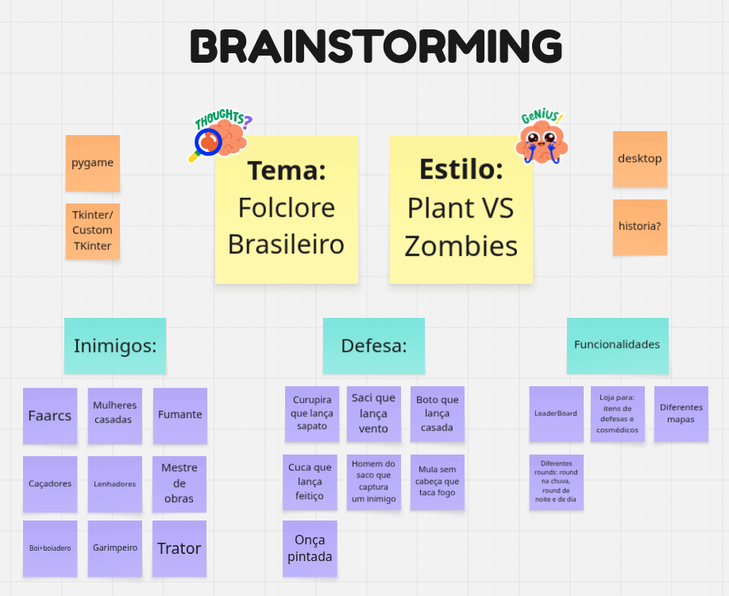
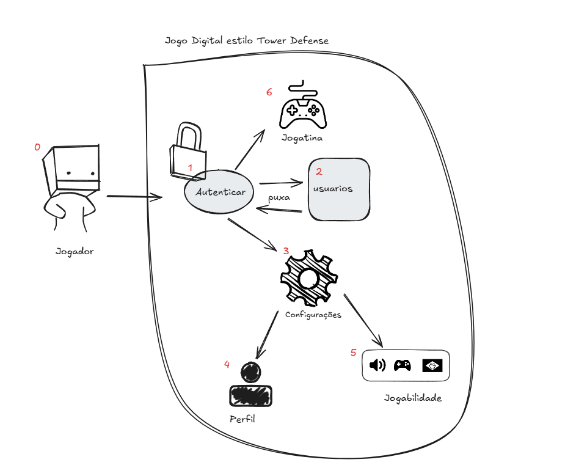
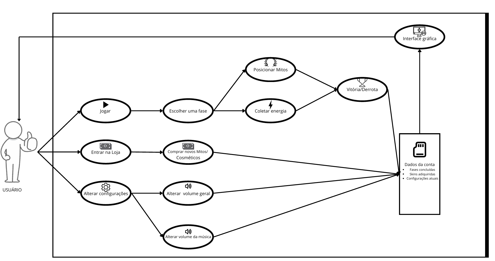
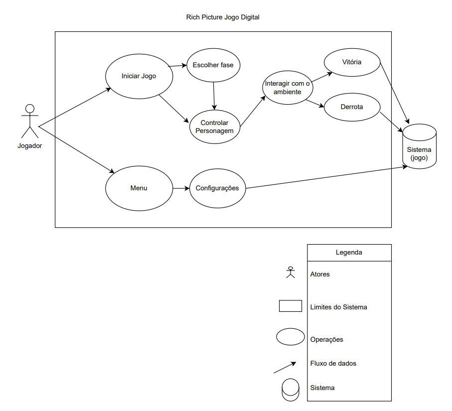
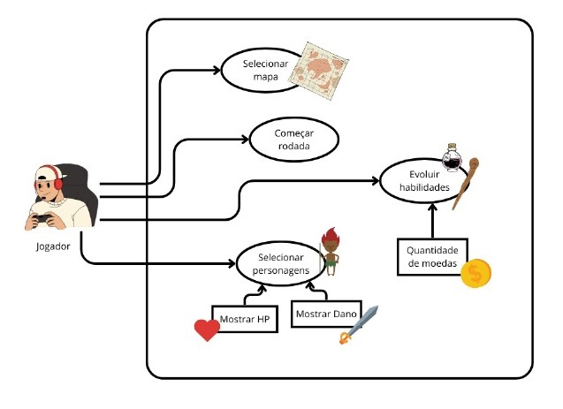
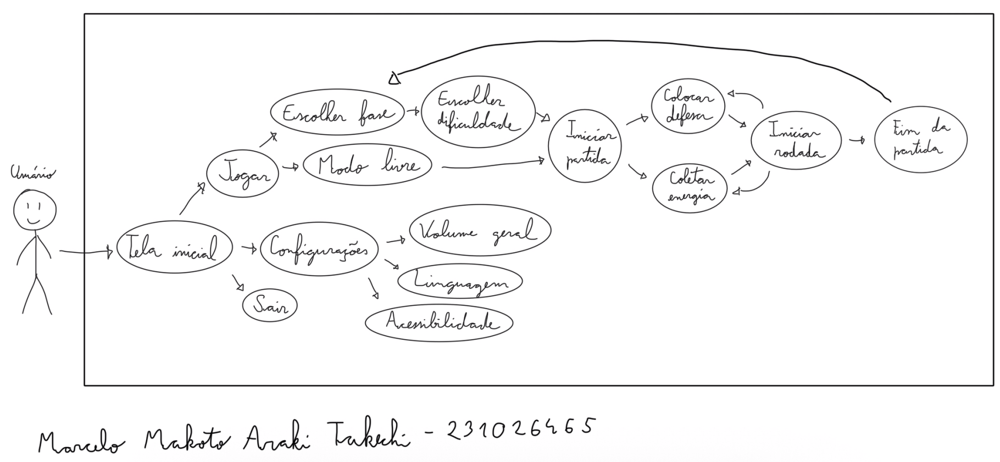
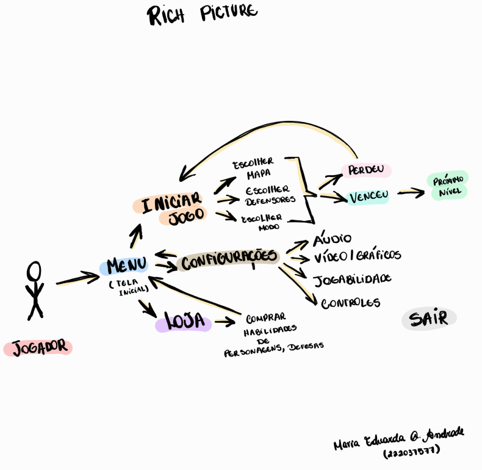
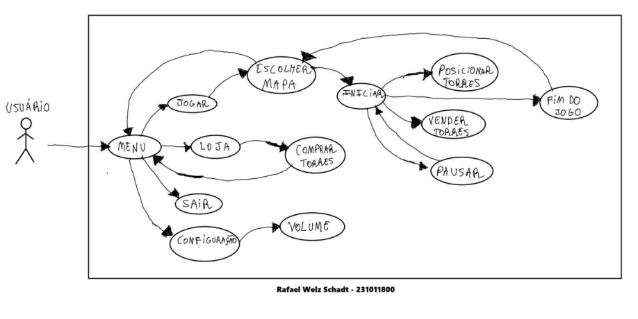
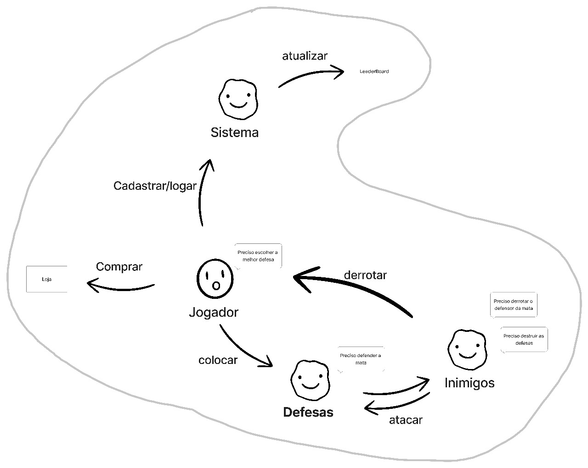
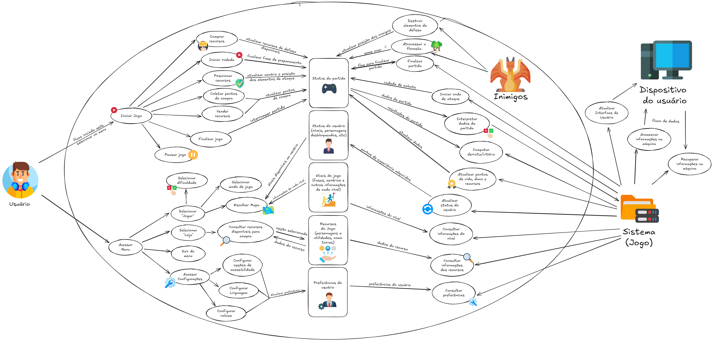

# 1.1. Módulo Design Sprint

## Introdução

O *Design Sprint* é uma metodologia ágil de cinco dias criada pelo Google Ventures para acelerar o processo de validação de ideias e solução de problemas complexos através de prototipagem e testes com usuários reais<a id="anchor_1" href="#REF1">^1^</a>. Esta abordagem permite que equipes multidisciplinares colaborem de forma estruturada para desenvolver, prototipar e testar soluções inovadoras em um curto período de tempo. O objetivo principal é reduzir riscos e incertezas antes de investir recursos significativos no desenvolvimento de um produto ou funcionalidade.

## Metodologia

A metodologia do Design Sprint foi aplicada pelo nosso grupo seguindo as cinco etapas fundamentais da metodologia original. Durante o processo, todos os participantes do grupo colaboraram ativamente em cada fase, conforme documentado em [*Participantes*](#participantes). As etapas incluem: **Mapear** (compreensão do problema), **Esboçar** (geração de ideias), **Decidir** (seleção da melhor solução), **Prototipar** (criação de um protótipo) e **Testar** (validação com usuários). Cada etapa foi cuidadosamente planejada e executada para garantir o máximo aproveitamento do tempo e a geração de insights valiosos para o desenvolvimento do projeto.

## Participantes

Tabela 1: Participantes

<table>
  <thead>
    <tr>
      <th>Nome</th>
      <th>Função</th>
      <th>Data</th>
      <th>Hora</th>
    </tr>
  </thead>
  <tbody>
    <tr>
      <td><a href="https://github.com/caioduart3">Caio Duarte</a></td>
      <td>Elaboração dos artefatos Design Sprint</td>
      <td>03/09/2025</td>
      <td>18:00</td>
    </tr>
    <tr>
      <td><a href="https://github.com/danielle-soaress">Danielle Soares</a></td>
      <td>Elaboração dos artefatos Design Sprint</td>
      <td>03/09/2025</td>
      <td>20:05</td>
    </tr>
    <tr>
      <td><a href="https://github.com/EnzoEmir">Enzo Emir</a></td>
      <td>Elaboração dos artefatos Design Sprint</td>
      <td>04/09/2025</td>
      <td>11:00</td>
    </tr>
    <tr>
      <td><a href="https://github.com/felixlaryssa">Laryssa Félix</a></td>
      <td>Elaboração dos artefatos Design Sprint</td>
      <td>04/09/2025</td>
      <td>15:20</td>
    </tr>
    <tr>
      <td><a href="https://github.com/Leticia-Arisa-K-Higa">Leticia Arisa</a></td>
      <td>Elaboração dos artefatos Design Sprint</td>
      <td>04/09/2025</td>
      <td>19:00</td>
    </tr>
    <tr>
      <td><a href="https://github.com/MM4k">Marcelo Makoto</a></td>
      <td>Elaboração dos artefatos Design Sprint</td>
      <td>03/09/2025</td>
      <td>21:15</td>
    </tr>
    <tr>
      <td><a href="https://github.com/dudaa28">Maria Eduarda</a></td>
      <td>Elaboração dos artefatos Design Sprint</td>
      <td>03/09/2025</td>
      <td>14:50</td>
    </tr>
    <tr>
      <td><a href="https://github.com/RafaelSchadt">Rafael Welz</a></td>
      <td>Elaboração dos artefatos Design Sprint</td>
      <td>04/09/2025</td>
      <td>11:00</td>
    </tr>
    <tr>
      <td><a href="https://github.com/VictorPontual">Victor Pontual</a></td>
      <td>Elaboração dos artefatos Design Sprint</td>
      <td>03/09/2025</td>
      <td>20:00</td>
    </tr>
  </tbody>
</table>

Fonte: [Maria Eduarda](https://github.com/dudaa28) 2025.

## Unpack 

### Brainstorming

Foi utilizada a técnica de brainstorm, com a participação de todos os integrantes na geração de ideias. Por meio de reuniões, coletamos sugestões de cada membro e chegamos a um consenso sobre o conceito do nosso jogo, incluindo gênero, tipo, personagens e outros aspectos relevantes do projeto. Para realizar o brainstorm, utilizamos a ferramenta Miro.

Imagem 1: Brainstorming

Fonte: [Danielle Soares](https://github.com/danielle-soaress),[Maria Eduarda](https://github.com/dudaa28), 2025.

## Sketch

### Rich Picture 

Rich Picture <a id="TEC2" href="#RP2">2</a> é uma técnica visual utilizada na análise de sistemas para representar, de forma livre e informal, a visão geral de um problema, seus atores (quem participa do sistema), operações (o que é feito ou quais ações ocorrem no sistema), armazenamento de dados (onde e como as informações são guardadas), setas (fluxo de informação, comunicação ou influência entre os elementos) e fronteira do sistema (limites do que está sob controle dos desenvolvedores ou do escopo do sistema). Ele é frequentemente usado na fase inicial da modelagem de sistemas.

A seguir, as figuras ilustram os rich pictures feitos, individualmente, por cada integrante do grupo. Posteriormente, essas ideias foram consolidadas em um rich picture final.

??? note "Rich Picture Individual: Caio Duarte"

    <figure style="text-align: center;">
        
        <figcaption>
            

                Figura 2: Rich Picture Individual (Fonte: <a href="https://github.com/caioduart3">Caio Duarte</a>, 2025)
            

        </figcaption>
    </figure>

??? note "Rich Picture Individual: Danielle Soares"

    <figure style="text-align: center;">
        
        <figcaption>
            

                Figura 2: Rich Picture Individual (Fonte: <a href="https://github.com/danielle-soaress">Danielle Soares</a>, 2025)
            

        </figcaption>
    </figure>

??? note "Rich Picture Individual: Enzo Emir"

    <figure style="text-align: center;">
        
        <figcaption>
            

                Figura 3: Rich Picture Individual. (Fonte: <a href="https://github.com/EnzoEmir">Enzo Emir</a>, 2025)
            

        </figcaption>
    </figure>

??? note "Rich Picture Individual: Laryssa Félix"

    <figure style="text-align: center;">
        
        <figcaption>
            

                Figura 4: Rich Picture Individual. (Fonte: <a href="https://github.com/felixlaryssa">Laryssa Félix</a>, 2025)
            

        </figcaption>
    </figure>

??? note "Rich Picture Individual: Leticia Arisa"

    <figure style="text-align: center;">
        
        <figcaption>
            

                Figura 5: Rich Picture Individual. (Fonte: <a href="https://github.com/Leticia-Arisa-K-Higa">Leticia Arisa</a>, 2025)
            

        </figcaption>
    </figure>

??? note "Rich Picture Individual: Marcelo Makoto"

    <figure style="text-align: center;">
        
        <figcaption>
            

                Figura 6: Rich Picture Individual. (Fonte: <a href="https://github.com/MM4k">Marcelo Makoto</a>, 2025)
            

        </figcaption>
    </figure>

??? note "Rich Picture Individual: Maria Eduarda"

    <figure style="text-align: center;">
        
        <figcaption>
            

                Figura 7: Rich Picture Individual. (Fonte: <a href="https://github.com/dudaa28">Maria Eduarda</a>, 2025)
            

        </figcaption>
    </figure>

??? note "Rich Picture Individual: Rafael Welz"

    <figure style="text-align: center;">
        
        <figcaption>
            

                Figura 8: Rich Picture Individual. (Fonte: <a href="https://github.com/RafaelSchadt">Rafael Welz</a>, 2025)
            

        </figcaption>
    </figure>

??? note "Rich Picture Individual: Victor Pontual"

    <figure style="text-align: center;">
        
        <figcaption>
            

                Figura 9: Rich Picture Individual. (Fonte: <a href="https://github.com/VictorPontual">Victor Pontual</a>, 2025)
            

        </figcaption>
    </figure>

### 5W2H

O 5W2H é uma ferramenta de gestão e planejamento usada para organizar ideias, estruturar ações e criar planos de forma simples e prática.
O nome vem das iniciais em inglês das perguntas que devem ser respondidas:

??? note "What (O quê)?"
    Desenvolver um jogo estilo Tower defense para desktop com a temática mitologia brasileira
    
??? note "Why (Por quê)?"
    Para informar e motivar as pessoas a conhecerem mais da cultura brasileira

??? note "Where (Onde)?"
    Para desktop com Pygame, não é necessário acesso a internet para jogar.

??? note "When (Quando)?"
    de agosto de 2025 até dezembro de 2025.

??? note "Who (Quem)?"
    
    Equipe do Projeto: 
    <table align="center">
      <tr>
        <td align="center">
           
          <b><a href="https://github.com/caioduart3">Caio Duarte</a></b> 
        </td>
        <td align="center">
           
          <b><a href="https://github.com/danielle-soaress">Danielle Soares</a></b> 
        </td>
        <td align="center">
           
          <b><a href="https://github.com/EnzoEmir">Enzo Emir</a></b> 
        </td>
        <td align="center">
           
          <b><a href="https://github.com/felixlaryssa">Laryssa Félix</a></b> 
        </td>
        <td align="center">
           
          <b><a href="https://github.com/Leticia-Arisa-K-Higa">Leticia Arisa</a></b> 
        </td>
        <td align="center">
           
          <b><a href="https://github.com/MM4k">Marcelo Makoto</a></b> 
        </td>
      </tr>
      <tr>
        <td align="center">
           
          <b><a href="https://github.com/dudaa28">Maria Eduarda</a></b> 
        </td>
        <td align="center">
           
          <b><a href="https://github.com/VictorPontual">Victor Pontual</a></b> 
        </td>
        <td align="center">
           
          <b><a href="https://github.com/RafaelSchadt">Rafael Welz</a></b> 
        </td>
      </tr>
    </table>

    Público-alvo: Pessoas interessadas em jogos estilos tower defense (Ex: Plants vs Zombie).

??? note "How (Como)?"
    Com pesquisa e ánalise de jogos já existentes na área, planejamento para as principais funcionalidades: Inicar jogo, pausar, escolher mapa, escolher dificuldade, entre outras.
    Utilizando a biblioteca Pygame para desenvolver o jogo com python, utilizando também github para versionar o trabalho e mkdocs para documentar a arquitetura e desenho
    utilizando de metodologias ágeis para desenvolvimento

??? note "How much (Quanto)?"
    A princípio o objetivo é que todo o projeto não tenha custos financeiros.

Fonte: [Caio Duarte](https://github.com/caioduart3), [Rafael Schadt](https://github.com/rafaelschadt), 2025.

### Diagrama de Causa e Efeito (Ishikawa)

O Diagrama de Causa e Efeito, também conhecido como Diagrama de Ishikawa ou Espinha de Peixe, é uma ferramenta utilizada para identificar e organizar as possíveis causas de um problema específico (o "efeito"). Para este projeto, o efeito analisado foi o "Baixo engajamento dos jogadores".

Imagem 2: Diagrama de Causa e Efeito

* **Efeito:** Atraso na entrega do projeto
    * **Gameplay / Mecânicas:**
        * Curva de dificuldade mal calibrada
        * Falta de variedade nas torres e inimigos
        * Ritmo de jogo lento em excesso

    * **Som / Música:**
        * Ausência de feedback auditivo claro para ações importantes.
        * Efeitos sonoros sem impacto ou mal sincronizados
        * Trilha repetitiva e cansativa

    * **Conteúdo / Temática:**
        * Falta de conexão entre personagens e suas habilidades 
        * Estereótipos culturais podem gerar confusão
        * Referências folclóricas pouco conhecidas
    * **Tecnologia / Performance:**
        * Travamentos em dispositivos mais fracos
        * Carregamentos demorados
        * Problemas de compatibilidade
    
    * **Arte / Visual:**
        * Interface pouco intuitiva
        * Paleta de cores que confunde cenário com unidades
        * Sprites mal definidos ou inconsistentes

    * **Jogadores / Experiência:**
        * Público-alvo sem familiaridade com Tower Defense
        * Desinteresse de jogadores que preferem jogos mais rápidos
        * Frustração com fases muito longas ou difíceis 

Fonte: [Enzo Emir](https://github.com/EnzoEmir), [Marcelo Makoto](https://github.com/MM4k), 2025.

### Estimativas

Este documento apresenta as **estimativas de esforço, tempo e custo** para o desenvolvimento do projeto, utilizando a técnica de **Avaliação de Especialista**.
Essa técnica consiste em reunir pessoas com experiência no domínio ou projeto (neste caso, dois membros da equipe), que discutem e atribuem valores de esforço para cada atividade. A estimativa final é obtida pela **média ou consenso** das opiniões.

---

#### Informações do Projeto

* **Nome do projeto:** Jogo Digital
* **Grupo:** 01
* **Professora:** Milene Serrano
* **Plataforma alvo:** Desktop

---

#### Premissas e Restrições

Tabela 2: Premissas e Restrições

|  ID | Premissa/Restrição |      Impacto     | Observação |
| :-: | :----------------- | :--------------: | :--------- |
|  P1 | Desenvolvimento em Python          |Médio | Liguagem de programação principal definida   |
|  R1 | Tempo de entrega acadêmico          | Alto | Datas fixas de disciplina   |
|  R2 | Funcionalidades priorizadas           |Médio | Loja, inimigos e defesas simples na 1ª versão   |

---

#### Método de Estimativa

* **Técnica:** Avaliação de Especialista
* **Participantes:** Victor Pontual, Leticia Arisa
* **Critério de consenso:** Média aritmética

---

##### **Lista de Atividades**

Com base no **Rich Picture**, as estimativas feitas pelos 2 especialistas depois são distribuídas entre os **10 membros**:

Tabela 3: Lista de Atividades

| ID | Atividade             | Descrição                                | Estimativa A (h) | Estimativa B (h) | Estimativa Final (h) | Alocação de Equipe |
| -- | --------------------- | ---------------------------------------- | ---------------- | ---------------- | -------------------- | ------------------ |
| 1  | Menu Inicial          | Implementar menu, configs, loja          |       5h         |       6h         |        5.5h          | 2 devs             |
| 2  | Configurações         | Acessibilidade, volume, prefs            |      10h         |      12h         |        11h           | 1 dev              |
| 3  | Loja                  | Comprar e vender recursos                |      25h         |      28h         |        26.5h         | 2 devs             |
| 4  | Modo de Jogo          | Dificuldade, mapa, fases                 |      30h         |      32h         |        31h           | 2 devs             |
| 5  | Rodadas               | Ciclo de início, defesa, vitória/derrota |      20h         |      18h         |        19h           | 3 devs             |
| 6  | Inimigos              | IA básica e ataques                      |      20h         |      22h         |        21h           | 2 devs             |
| 7  | Defesas               | Implementar personagens folclóricos      |      40h         |      38h         |        39h           | 3 devs             |
| 8  | Status do Jogador     | Vida, pontos, recursos                   |      10h         |      9h          |        9.5h          | 2 devs             |
| 9  | Pontuação/Ranking     | Contagem de pontos e vitórias            |       5h         |      6h          |        5.5h          | 1 dev              |
| 10 | Persistência de dados | Salvar/carregar progresso                |      20h         |      18h         |        19h           | 2 devs             |
| 11 | Testes                | Jogabilidade e feedback                  |      60h         |      62h         |        61h           | Equipe inteira     |

#### Estimativa de Esforço e Tempo

* **Unidade usada:** Horas
* **Esforço total estimado:** 258h
* **Tempo previsto (cronograma):** 4 semanas
* **Equipe:** 10 pessoas

#### Estimativa de Custo

Definir custo-hora da equipe e multiplicar pelo esforço. Foi considerado a média salarial de R$30,00/h para uma equipe de desenvolvedores provida pelo Glassdoor.

| Item                     | Valor    |
| ------------------------ | -------- |
| Custo por hora (R$)      | 30,00    |
| Esforço total (h)        | 258      |
| **Custo estimado (R$)**  | 7.740    |

#### Cronograma Macro
| Marco                 | Início   | Fim      | Responsável |
| --------------------- | -------- | -------- | ----------- |
| Protótipo             | 03/09 | 04/09 | todos    |
| Implementação inicial | 05/09 | 30/09 | equipe de desenvolvimento |
| Testes e ajustes      | 01/10 | 30/10 | equipe de testes |
| Entrega final         | 31/10 | 31/10 | todos |

#### Riscos e Contingências
| Risco                        | Probabilidade      | Impacto         | Mitigação                       |
| ---------------------------- | ------------------ | --------------- | -------------------------------- |
| Atraso na entrega            | Média              | Alto            | Revisão semanal do progresso     |
| Falta de experiência técnica | Baixa              | Médio           | Treinamento e apoio entre membros|
| Mudança de requisitos        | Média              | Médio           | Documentação clara e comunicação |
| Problemas de integração      | Baixa              | Alto            | Testes frequentes e integração contínua |

#### Resultados e Conclusões

Resumo das principais métricas:

* **Esforço total:** 258h
* **Tempo previsto:** 2 meses
* **Custo estimado:** R$ 7.740

Decisões tomadas:
- Utilização da técnica de Avaliação de Especialista para estimativas
- Definição de cronograma macro para garantir entrega em 2 meses
- Priorização de funcionalidades essenciais na primeira versão

Fonte: [Victor Pontual](https://github.com/VictorPontual), [Leticia Arisa](https://github.com/Leticia-Arisa-K-Higa), 2025.

## Decision

### Rich Picture 

A seguir, a Figura 1 mostra o Rich Picture final, que foi elaborado a partir da consolidação das ideias individuais de cada membro do grupo. Para a criação desse material, cada integrante do grupo desenvolveu o seu próprio Rich Picture com base nas suas ideias. Posteriormente,essas ideias foram consolidadas em um único Rich Picture que melhor representasse a visão geral do sistema.

<figure style="text-align: center;">
    
    <figcaption>
        

            Figura 1: Rich Picture Final (Fonte: <a href="https://github.com/danielle-soaress">Danielle Soares</a>, 2025)
        

    </figcaption>
</figure>

### Storyboard

O storyboard é uma representação visual das principais etapas e interações do usuário com o jogo, permitindo antecipar o fluxo da experiência e validar ideias de design antes do desenvolvimento do protótipo. Ele auxilia a equipe a alinhar expectativas, identificar possíveis melhorias e comunicar de forma clara como será a jornada do jogador.

Imagem 3: Storyboard

  
Fonte: <a href="https://github.com/caioduart3">Caio Duarte</a>, <a href="https://github.com/MM4k">Marcelo Makoto</a>, 2025.

## Prototype

Durante o Design Sprint, criamos a estrutura visual inicial do protótipo para o projeto do Jogo Online. O objetivo foi traduzir as ideias e funcionalidades mapeadas nas fases anteriores em telas interativas. Isso nos permite simular a experiência do usuário e validar os fluxos principais do sistema.

Desenvolvemos o protótipo utilizando o Figma, uma ferramenta colaborativa e baseada na web. O Figma é ideal para criar interfaces, testar fluxos de navegação e fazer ajustes rapidamente, além de facilitar o trabalho em equipe.

Confira o protótipo interativo no Figma neste [link](https://www.figma.com/design/aliUOnJYHF1sKUYTb60QPp/Protótipo---ArqDsw?node-id=101-65&t=XIwEP4VnzLsmNRzI-0).

<iframe style="border: 1px solid rgba(0, 0, 0, 0.1);" width="800" height="450" src="https://embed.figma.com/proto/aliUOnJYHF1sKUYTb60QPp/Prot%C3%B3tipo---ArqDsw?node-id=125-8&p=f&scaling=min-zoom&content-scaling=fixed&page-id=0%3A1&starting-point-node-id=125%3A8&embed-host=share" allowfullscreen></iframe>

Fonte: [Caio Duarte](https://github.com/caioduart3), [Danielle Soares](https://github.com/danielle-soaress), [Enzo Emir](https://github.com/EnzoEmir), [Laryssa Félix](https://github.com/felixlaryssa), [Letícia Arisa](https://github.com/Leticia-Arisa-K-Higa), [Marcelo Makoto](https://github.com/MM4k), [Maria Eduarda](https://github.com/dudaa28), [Victor Pontual](https://github.com/VictorPontual) e [Rafael Welz](https://github.com/RafaelSchadt) 2025.

## Testing 

A etapa de **Testing** é a última fase do *Design Sprint*. Nela, o protótipo desenvolvido é testado por usuários reais para validar hipóteses, identificar pontos fortes, levantar oportunidades de melhoria e verificar se a solução proposta gera valor. O objetivo principal é coletar feedbacks qualitativos que orientem os próximos passos do desenvolvimento.

### Vídeo da Reunião ▶️

<iframe width="560" height="315" src="https://www.youtube.com/embed/pvgKnVOWKwo" title="YouTube video player" frameborder="0" allowfullscreen></iframe>

## Transcrição da Reunião

**Maria Eduarda:**  
Então, chegamos na parte do teste, que é uma das etapas do nosso sprint. Chamamos você para validar o protótipo e nos dar alguns feedbacks sobre o que pode melhorar, certo?

**Participante:**  
Isso.

**Maria Eduarda:**  
Eu também vou fazer algumas perguntas ao longo do processo, tá bom? Primeiro você vai mexer no protótipo, e depois a gente bate um papo. Pode ser?

**Participante:**  
Beleza, tranquilo.

**Maria Eduarda:**  
Antes de começar, só recapitulando rapidamente para deixar registrado: o jogo é inspirado no *Plants vs Zombies*, mas com a temática do folclore brasileiro. Diferente da segunda versão do jogo original, que tem muitos personagens, a gente está baseando mais na primeira versão, para conseguir entregar dentro do tempo da disciplina. Aqui, por exemplo, você consegue evoluir os personagens durante a partida e comprar novos.

**Participante:**  
Entendi.

**Maria Eduarda:**  
Então vamos lá para as perguntas. Primeiro: o que mais te chamou a atenção no protótipo?

**Participante:**  
Eu gostei bastante do design minimalista, acho que dá uma característica muito interessante. Gostei muito das artes, tanto dos personagens jogáveis quanto dos oponentes. Também achei bem legal a mecânica de poder upar os personagens, porque isso diferencia do jogo em que vocês se basearam. Dá mais variedade sem precisar ficar criando um monte de novos personagens.

**Maria Eduarda:**  
Legal! E teve algo que ficou confuso ou difícil de entender?

**Participante:**  
Não, achei bem simples e direto, deu pra entender tranquilo.

**Maria Eduarda:**  
Perfeito. De 0 a 10, que nota você daria para a ideia do jogo?

**Participante:**  
Eu acho que ainda falta algum detalhe para ser um 10, mas está bem interessante. Então eu daria um 9.

**Maria Eduarda:**  
Boa! E o que você mudaria ou melhoraria?

**Participante:**  
Talvez deixar os oponentes um pouco mais fortes. Já que tem sistema de evolução dos personagens, podia ter também um aumento de dificuldade nas ondas dos inimigos, para não ficar fácil demais.

**Maria Eduarda:**  
Faz sentido. E você acha que o jogo parece simples demais, complicado demais ou está na medida certa?

**Participante:**  
Na medida certa, por enquanto.

**Maria Eduarda:**  
E para fechar: você recomendaria esse jogo para um amigo seu? Por quê?

**Participante:**  
Sim, recomendaria. Acho que dá para passar o tempo, é divertido e tem potencial para ficar ainda mais interessante.

**Maria Eduarda:**  
Ótimo! Então basicamente é isso. Muito obrigada pelo feedback.

**Análise resumida:**  
Com base no teste, o participante destacou como pontos fortes o design minimalista, a arte dos personagens e a mecânica de evolução. Como melhoria principal, sugeriu aumentar a dificuldade das ondas de inimigos para equilibrar a jogabilidade. No geral, atribuiu nota **9** ao protótipo e afirmou que recomendaria o jogo a amigos.

Fonte: [Caio Duarte](https://github.com/caioduart3), [Danielle Soares](https://github.com/danielle-soaress), [Enzo Emir](https://github.com/EnzoEmir), [Laryssa Félix](https://github.com/felixlaryssa), [Letícia Arisa](https://github.com/Leticia-Arisa-K-Higa), [Marcelo Makoto](https://github.com/MM4k), [Maria Eduarda](https://github.com/dudaa28), [Victor Pontual](https://github.com/VictorPontual) e [Rafael Welz](https://github.com/RafaelSchadt) 2025.

---
## Referências Bibliográficas

> <a id="REF1">1.</a> THE DESIGN SPRINT. GV – Google Ventures. Disponível em: https://www.gv.com/sprint/
. Acesso em: 2 set. 2025.

> <a id="RP2" href="#TEC"2>2.</a> MONK, Andrew; HOWARD, Steve. The Rich Picture: A Tool for Reasoning About Work Context. 1998.  Disponível em: <<https://ics.uci.edu/~wscacchi/Software-Process/Readings/RichPicture.pdf>>. Acesso em: 12/04/2025.

## Histórico de Versões 📅

| Versão | Data | Descrição | Autor(es) | Revisor( es) |
| :-: | :-: | :-: | :-: | :-: |
| `0.1` | 02/09/2025 | Criação da Página | [Enzo Emir](https://github.com/EnzoEmir) | [Danielle Soares](https://github.com/danielle-soaress) |
| `0.2` | 02/09/2025 | Correção na tabela de participantes | [Danielle Soares](https://github.com/danielle-soaress) | [Leticia Arisa](https://github.com/Leticia-Arisa-K-Higa) |
| `0.3` | 04/09/2025 | Adição de conteúdo na seção unpack | [Leticia Arisa](https://github.com/Leticia-Arisa-K-Higa) | [Danielle Soares](https://github.com/danielle-soaress) |
| `0.4` | 04/09/2025 | Rich picture e Protótipo | [Danielle Soares](https://github.com/danielle-soaress) | [Leticia Arisa](https://github.com/Leticia-Arisa-K-Higa) |
| `0.5` | 04/09/2025 | Adição da Estimativas | [Leticia Arisa](https://github.com/Leticia-Arisa-K-Higa) | [Marcelo Makoto](https://github.com/MM4k) |
| `0.6` | 04/09/2025 | Adição de Storyboard | [Marcelo Makoto](https://github.com/MM4k) | [Enzo Emir](https://github.com/EnzoEmir) |
| `0.7` | 05/09/2025 | Correções da pagina | [Enzo Emir](https://github.com/EnzoEmir) | [Danielle Soares](https://github.com/danielle-soaress) |
| `0.8` | 05/09/2025 | Correção no rich picture | [Danielle Soares](https://github.com/danielle-soaress) | [Enzo Emir](https://github.com/EnzoEmir) |
| `0.9` | 05/09/2025 | Rich Pictures individuais | [Danielle Soares](https://github.com/danielle-soaress) | [Enzo Emir](https://github.com/EnzoEmir) |
| `0.10` | 05/09/2025 | Adição Rich Picture Caio | [Enzo Emir](https://github.com/EnzoEmir) | [Caio Duarte](https://github.com/caioduart3) |
| `0.11` | 05/09/2025 | Adição 5w2h | [Caio Duarte](https://github.com/caioduart3) | [Rafael Schadt](https://github.com/rafaelschadt) |
| `0.12` | 05/09/2025 | Adição de transcrição do teste de validação | [Rafael Schadt](https://github.com/RafaelSchadt) | - |

Fonte: [Caio Duarte](https://github.com/caioduart3), [Danielle Soares](https://github.com/danielle-soaress), [Enzo Emir](https://github.com/EnzoEmir), [Laryssa Félix](https://github.com/felixlaryssa), [Letícia Arisa](https://github.com/Leticia-Arisa-K-Higa), [Marcelo Makoto](https://github.com/MM4k), [Maria Eduarda](https://github.com/dudaa28), [Victor Pontual](https://github.com/VictorPontual) e [Rafael Welz](https://github.com/RafaelSchadt) 2025.

