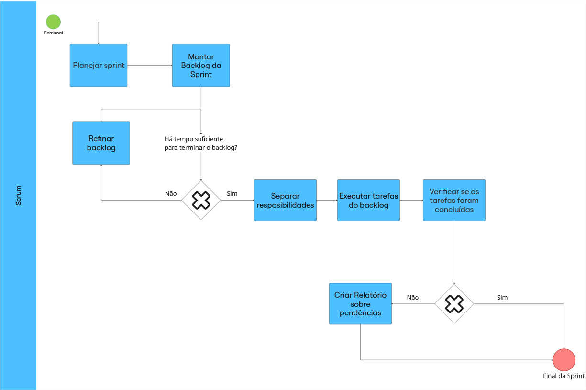
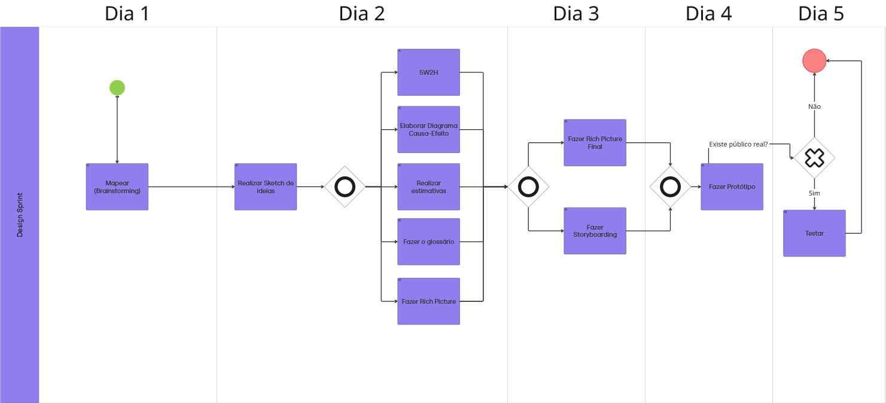

# 1.3. Módulo Modelagem BPMN

## Introdução

A modelagem de processos é uma atividade essencial para compreender,
documentar e aprimorar o fluxo de trabalho em diferentes contextos,
especialmente no desenvolvimento de software. Nesse cenário, a
**Business Process Model and Notation (BPMN)** se destaca por ser uma
notação padronizada e amplamente reconhecida pela comunidade científica
e pelo mercado, permitindo a representação clara e detalhada de
processos de negócio.

Adotada pela **Object Management Group (OMG)**, a BPMN proporciona uma
forma visual de comunicação entre diferentes perfis de stakeholders (partes interessadas),
favorecendo tanto a área técnica quanto a de negócios. Sua relevância se
deve à capacidade de representar atividades, papéis, interações,
eventos, temporalidades e fluxos de decisão de forma padronizada e
compreensível.

## Metodologia

A metodologia proposta considera a utilização da notação BPMN como
ferramenta de documentação e análise de processos. A partir do estudo feito pelo grupo de
diferentes abordagens ágeis, e escolhemos no uso do nosso Projeto: **Scrum**, **Design Sprint** e
**KABAM**. Foi elaborado um conjunto de fluxos que representam
metodologias híbridas de desenvolvimento, valorizando a clareza e a
colaboração entre a equipe.

O processo metodológico seguiu as etapas:

1. **Revisão dos conceitos da notação BPMN** (piscinas, raias, eventos,
gateways, subprocessos etc.).

2. **Escolha das metodologias a serem representadas**: Scrum, Design
Sprint e KABAM.

3. **Modelagem em BPMN dos fluxos principais de cada metodologia**,
destacando papéis, iterações e tomadas de decisão.

4. **Comparação e análise dos fluxos**, identificando pontos fortes e
oportunidades de integração em uma abordagem híbrida.

## Participantes

Tabela 1: Participantes

<strong>Tabela 2: Cronograma de Participantes</strong>

<table>
  <thead>
    <tr>
      <th>Nome</th>
      <th>Função</th>
      <th>Data</th>
      <th>Hora</th>
    </tr>
  </thead>
  <tbody>
    <tr>
      <td><a href="https://github.com/caioduart3">Caio Duarte</a></td>
      <td>Fluxo 1 - Scrum</td>
      <td>04/09/2025</td>
      <td>19:00</td>
    </tr>
    <tr>
      <td><a href="https://github.com/danielle-soaress">Danielle Soares</a></td>
      <td>Fluxo 2 - Design Sprint</td>
      <td>04/09/2025</td>
      <td>19:00</td>
    </tr>
    <tr>
      <td><a href="https://github.com/EnzoEmir">Enzo Emir</a></td>
      <td>Fluxo 3 - Kanban</td>
      <td>04/09/2025</td>
      <td>19:00</td>
    </tr>
    <tr>
      <td><a href="https://github.com/felixlaryssa">Laryssa Félix</a></td>
      <td>Fluxo 1 - Scrum</td>
      <td>04/09/2025</td>
      <td>19:00</td>
    </tr>
    <tr>
      <td><a href="https://github.com/Leticia-Arisa-K-Higa">Leticia Arisa</a></td>
      <td>Fluxo 3 - Kanban</td>
      <td>04/09/2025</td>
      <td>19:00</td>
    </tr>
    <tr>
      <td><a href="https://github.com/MM4k">Marcelo Makoto</a></td>
      <td>Fluxo 2 - Design Sprint</td>
      <td>04/09/2025</td>
      <td>19:00</td>
    </tr>
    <tr>
      <td><a href="https://github.com/dudaa28">Maria Eduarda</a></td>
      <td>Fluxo 1 - Scrum</td>
      <td>04/09/2025</td>
      <td>19:00</td>
    </tr>
    <tr>
      <td><a href="https://github.com/RafaelSchadt">Rafael Welz</a></td>
      <td>Fluxo 3 - Kanban</td>
      <td>04/09/2025</td>
      <td>19:00</td>
    </tr>
    <tr>
      <td><a href="https://github.com/VictorPontual">Victor Pontual</a></td>
      <td>Fluxo 2 - Design Sprint</td>
      <td>04/09/2025</td>
      <td>19:00</td>
    </tr>
  </tbody>
</table>

Fonte: [Maria Eduarda](https://github.com/dudaa28) 2025.

## Desenvolvimento

### Fluxo 1 - Scrum

O fluxo em BPMN para o **Scrum** descreve a organização do **Product
Backlog**, a realização das **Sprints**, a execução das **Daily
Meetings** e a realização das cerimônias de **Review** e
**Retrospective**. A notação permite evidenciar os papéis de Product
Owner, Scrum Master e Time de Desenvolvimento, bem como as interações
entre eles. [Disponível aqui](https://miro.com/welcomeonboard/S1RmSytrZXJyRVlCWWRyanErTFhoZUthZlpMdEVxdFNPL3pXanluamdJVzBUU3lPN2NJYnUrbWd5Q2xnWFJrZ1VaY3Z5Q2JkOVg0enJGVXhZSVZUMzVFVjg3b0l2UE4zNDd6MjJjbld5S2tEQUdLTXRzajZiODFtMEgwMVBLUEZhWWluRVAxeXRuUUgwWDl3Mk1qRGVRPT0hdjE=?share_link_id=972361271498)

Fluxo 1: Scrum

Fonte: [Laryssa Felix](https://github.com/felixlaryssa),[Maria Eduarda](https://github.com/dudaa28), [Caio Duarte](https://github.com/caioduart3) 2025.

### Fluxo 2 - Design Sprint

No fluxo do **Design Sprint**, a modelagem foca nas cinco fases principais:
**Entender, Esboçar, Decidir, Prototipar e Testar**. O uso da BPMN
possibilita a identificação clara dos responsáveis por cada etapa, além
de destacar o caráter iterativo e colaborativo do processo. [Disponível aqui](https://miro.com/welcomeonboard/S1RmSytrZXJyRVlCWWRyanErTFhoZUthZlpMdEVxdFNPL3pXanluamdJVzBUU3lPN2NJYnUrbWd5Q2xnWFJrZ1VaY3Z5Q2JkOVg0enJGVXhZSVZUMzVFVjg3b0l2UE4zNDd6MjJjbld5S2tEQUdLTXRzajZiODFtMEgwMVBLUEZhWWluRVAxeXRuUUgwWDl3Mk1qRGVRPT0hdjE=?share_link_id=972361271498)

Fluxo 2: Design Sprint

Fonte: [Danielle Soares](https://github.com/danielle-soaress),[Marcelo Makoto](https://github.com/MM4k),[Victor Pontual](https://github.com/VictorPontual) 2025.

### Fluxo 3 - KANBAN

O método **KANBAN**, menos difundido, foi representado em BPMN para
demonstrar a sequência de atividades relacionadas à definição de
objetivos, análise de cenários, proposição de soluções e acompanhamento
da execução. A modelagem evidencia a importância da **retroalimentação
(feedback loops)** e da integração entre áreas distintas. [Disponível aqui](https://miro.com/welcomeonboard/S1RmSytrZXJyRVlCWWRyanErTFhoZUthZlpMdEVxdFNPL3pXanluamdJVzBUU3lPN2NJYnUrbWd5Q2xnWFJrZ1VaY3Z5Q2JkOVg0enJGVXhZSVZUMzVFVjg3b0l2UE4zNDd6MjJjbld5S2tEQUdLTXRzajZiODFtMEgwMVBLUEZhWWluRVAxeXRuUUgwWDl3Mk1qRGVRPT0hdjE=?share_link_id=972361271498)

Fluxo 3: Kanban

Fonte: [Enzo Emir](https://github.com/EnzoEmir),[Letícia Arisa](https://github.com/Leticia-Arisa-K-Higa),[Rafael Welz](https://github.com/RafaelSchadt) 2025.

## Referência Bibliográfica

> <a id="REF1">1.</a> SERRANO, Milene. **Arquitetura e Desenho de Software – Aula BPMN Exemplos**. Universidade de Brasília (UnB), [s.d.]. Disponível em: <https://aprender3.unb.br/pluginfile.php/3178381/mod_page/content/2/Arquitetura%20e%20Desenho%20de%20software%20-%20Aula%20BPMN%20Exemplos%20-%20Profa.%20Milene.pdf>. Acesso em: 5 set. 2025.  

> <a id="REF2">2.</a> SERRANO, Milene. **[04 - VideoAula - DSW-BPMN]**. [s.l.], [s.d.]. Recurso eletrônico (vídeo). Disponível em: <https://unbbr-my.sharepoint.com/:v:/g/personal/mileneserrano_unb_br/EU1pA17SX3VEttZ6KlARD_ABd-SNiJJ1AwODqrO9zEfQBw?e=QNj0WY&nav=...>. Acesso em: 5 set. 2025.  

> <a id="REF3">3.</a> UNIVERSIDADE DE BRASÍLIA (UNB). **Curso Bizagi** [Material em PDF]. Universidade de Brasília, [s.d.]. Disponível em: <https://aprender3.unb.br/pluginfile.php/3178381/mod_page/content/2/Curso%20Bizagi.pdf>. Acesso em: 5 set. 2025.  

## Histórico de Versões 📅

| Versão | Data | Descrição | Autor(es) | Revisor(es) |
| :--: | :--: | :--: | :--: | :--: |
| `0.1` | 04/09/2025 | Criação da página | [Maria Eduarda](https://github.com/dudaa28) | [Marcelo Makoto](https://github.com/MM4k) |

Fonte: [Caio Duarte](https://github.com/caioduart3), [Danielle Soares](https://github.com/danielle-soaress), [Enzo Emir](https://github.com/EnzoEmir), [Laryssa Félix](https://github.com/felixlaryssa), [Letícia Arisa](https://github.com/Leticia-Arisa-K-Higa), [Marcelo Makoto](https://github.com/MM4k), [Maria Eduarda](https://github.com/dudaa28), [Victor Pontual](https://github.com/VictorPontual) e [Rafael Welz](https://github.com/RafaelSchadt) 2025.

 