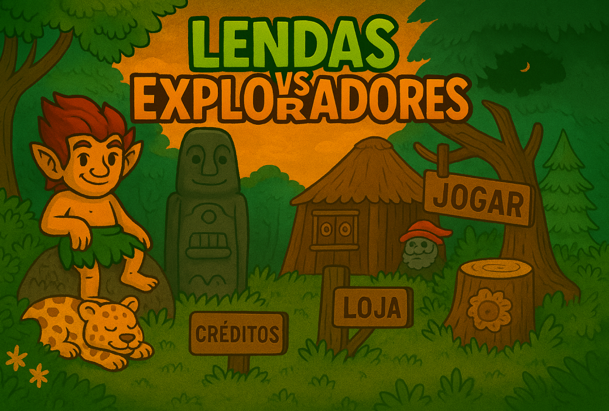
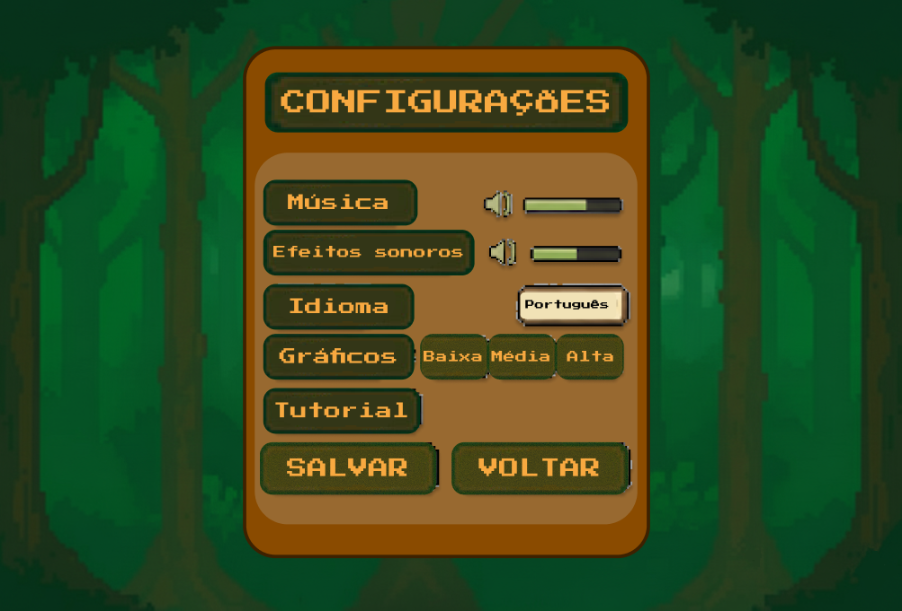
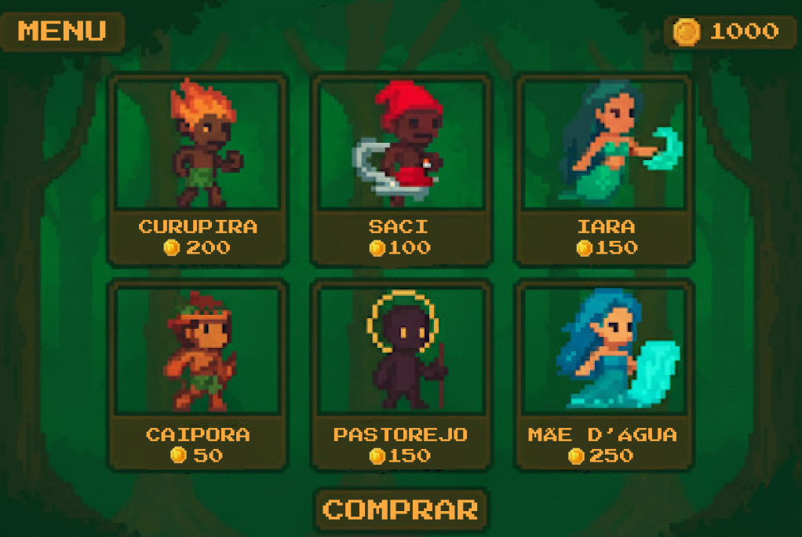
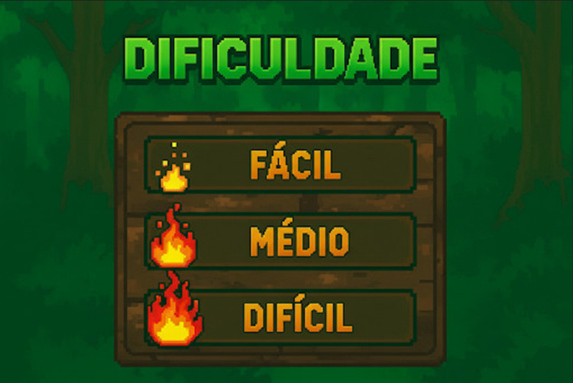
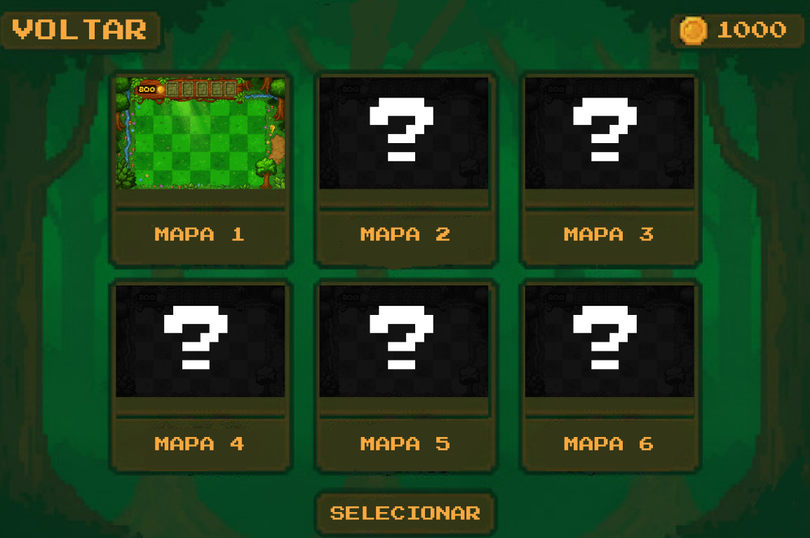
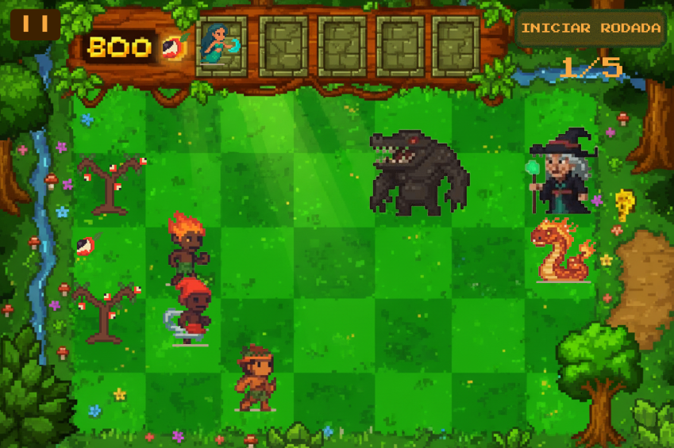
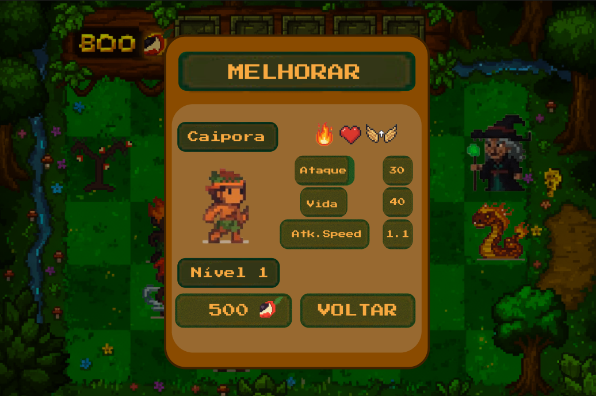
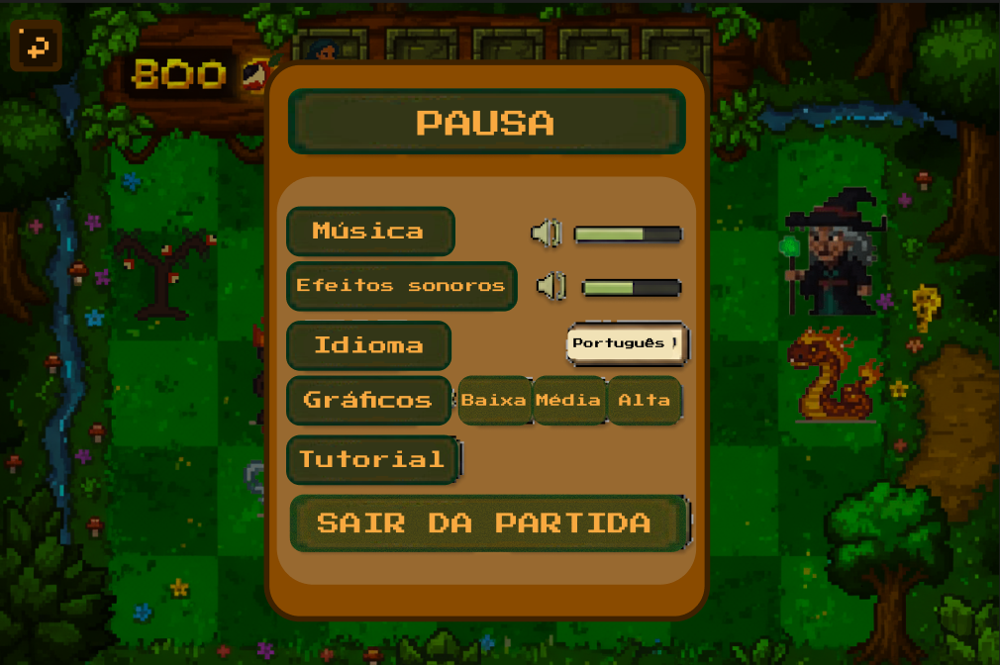

# Protótipo

# Introdução

Durante o Design Sprint, criamos a estrutura visual inicial do protótipo para o projeto do Jogo Online. O objetivo foi traduzir as ideias e funcionalidades mapeadas nas fases anteriores em telas interativas. Isso nos permite simular a experiência do usuário e validar os fluxos principais do sistema.

Desenvolvemos o protótipo utilizando o Figma, uma ferramenta colaborativa e baseada na web. O Figma é ideal para criar interfaces, testar fluxos de navegação e fazer ajustes rapidamente, além de facilitar o trabalho em equipe.

Confira o protótipo interativo no Figma neste [link](www.figma.com/proto/aliUOnJYHF1sKUYTb60QPp/Protótipo-ArqDsw?node-id=0-1&p=f&t=pYwq7iEAo1jgRTKy-0&scaling=min-zoom&content-scaling=fixed&page-id=0%3A1&starting-point-node-id=125%3A8).

<iframe style="border: 1px solid rgba(0, 0, 0, 0.1);" width="800" height="450" src="https://embed.figma.com/proto/aliUOnJYHF1sKUYTb60QPp/Prot%C3%B3tipo---ArqDsw?node-id=125-8&p=f&scaling=min-zoom&content-scaling=fixed&page-id=0%3A1&starting-point-node-id=125%3A8&embed-host=share" allowfullscreen></iframe>

<figure style="text-align: center;">
    
    <figcaption>
        

            Figura 1: Página inicial do protótipo.
        

    </figcaption>
</figure>

<figure style="text-align: center;">
    
    <figcaption>
        

            Figura 2: Página de configuração.
        

    </figcaption>
</figure>

<figure style="text-align: center;">
    
    <figcaption>
        

            Figura 3: Loja, onde os jogadores podem adquirir novos personagens.
        

    </figcaption>
</figure>

<figure style="text-align: center;">
    
    <figcaption>
        

            Figura 4: Seleção de dificuldade, o primeiro passo no fluxo para iniciar uma partida.
        

    </figcaption>
</figure>

<figure style="text-align: center;">
    
    <figcaption>
        

            Figura 5: Seleção de mapa, a segunda etapa no fluxo de início de jogo.
        

    </figcaption>
</figure>

<figure style="text-align: center;">
    
    <figcaption>
        

            Figura 6: Tela de jogo em andamento.
        

    </figcaption>
</figure>

<figure style="text-align: center;">
    
    <figcaption>
        

            Figura 7: Menu de melhorias para personagens, acessível após selecionar um personagem para evoluir.
        

    </figcaption>
</figure>

<figure style="text-align: center;">
    
    <figcaption>
        

            Figura 8: Menu de pausa, que pode ser acessado clicando no ícone correspondente no canto superior esquerdo durante uma partida.
        

    </figcaption>
</figure>

# Conclusão

Esta fase do Design Sprint foi importante para visualizar e validar os fluxos centrais da aplicação antes de iniciarmos a implementação. O protótipo criado no Figma servirá como base para os testes com usuários e para o desenvolvimento das próximas etapas do projeto.