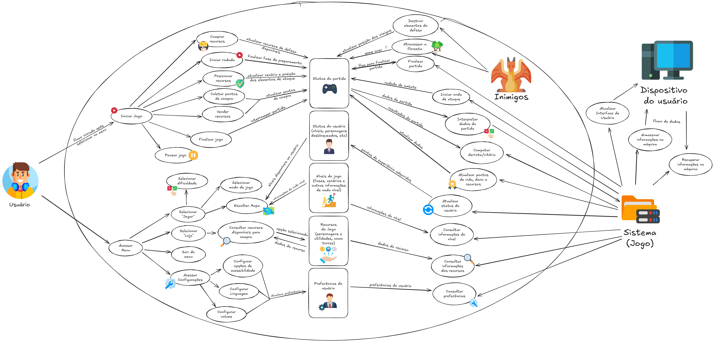
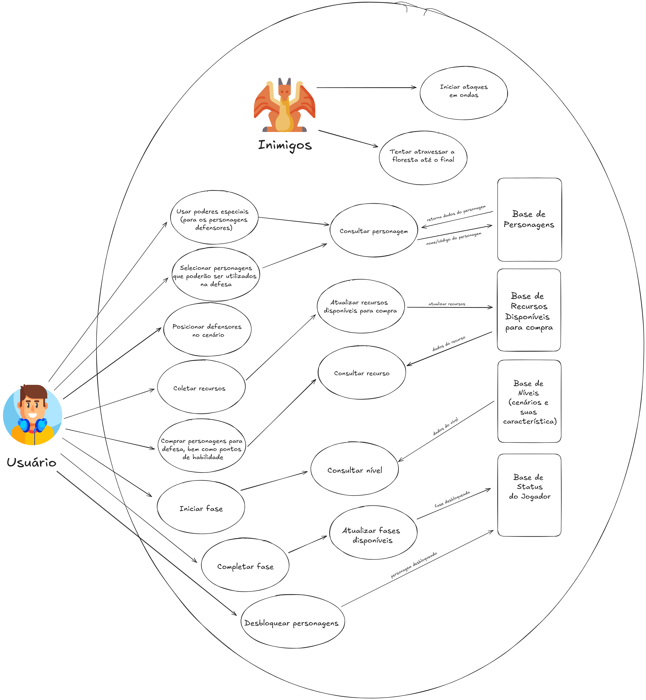
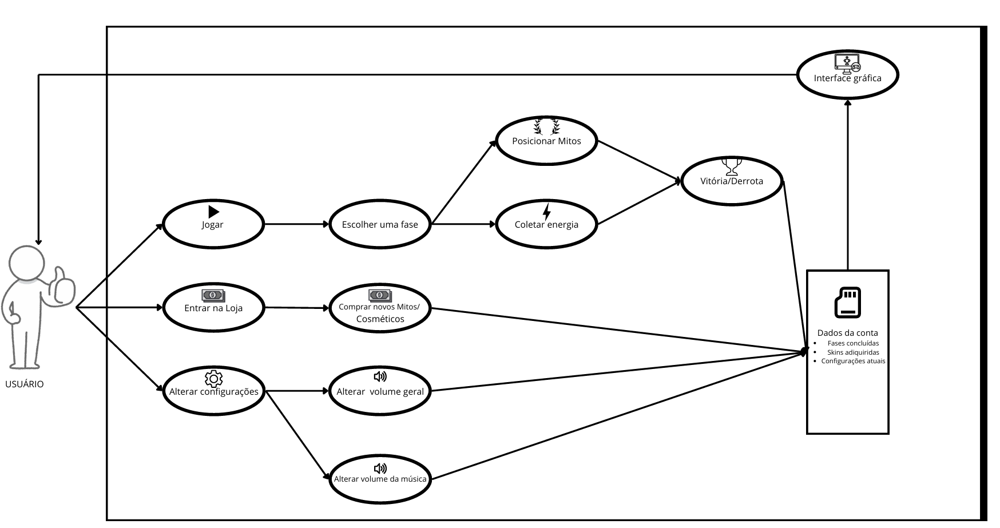
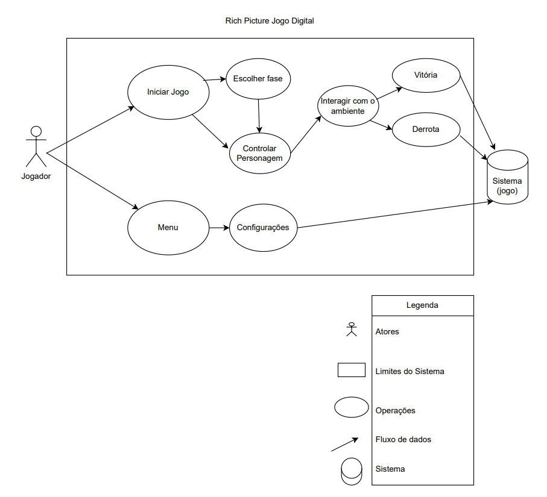
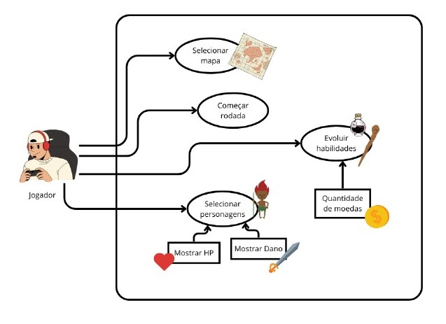
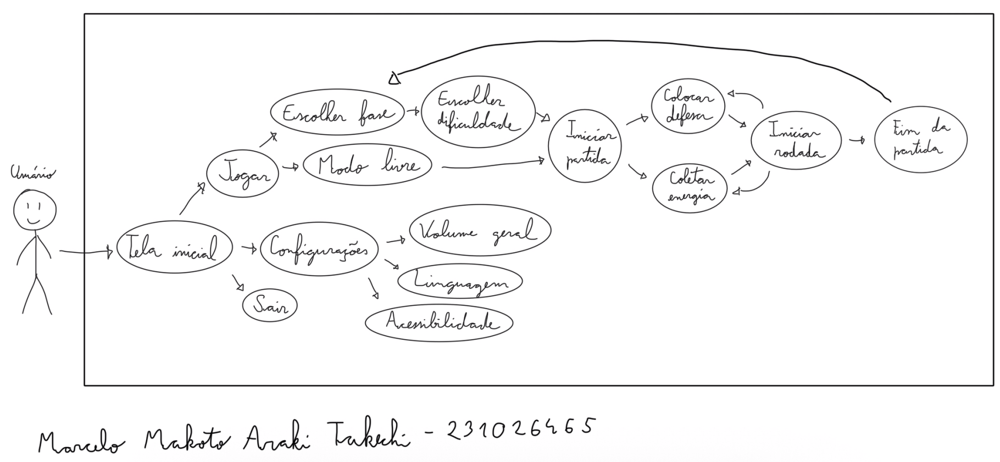
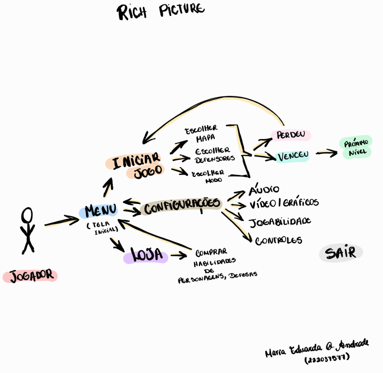
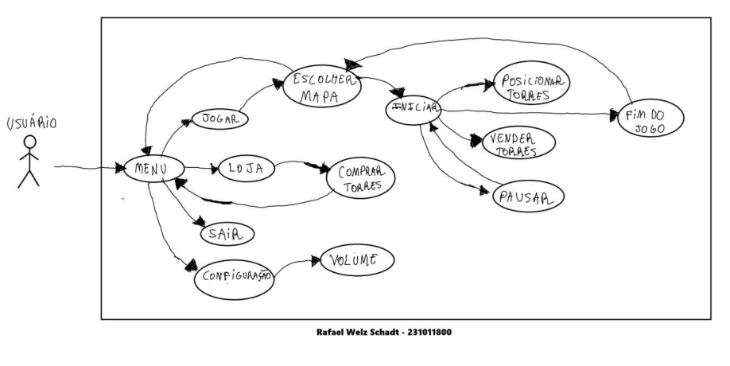
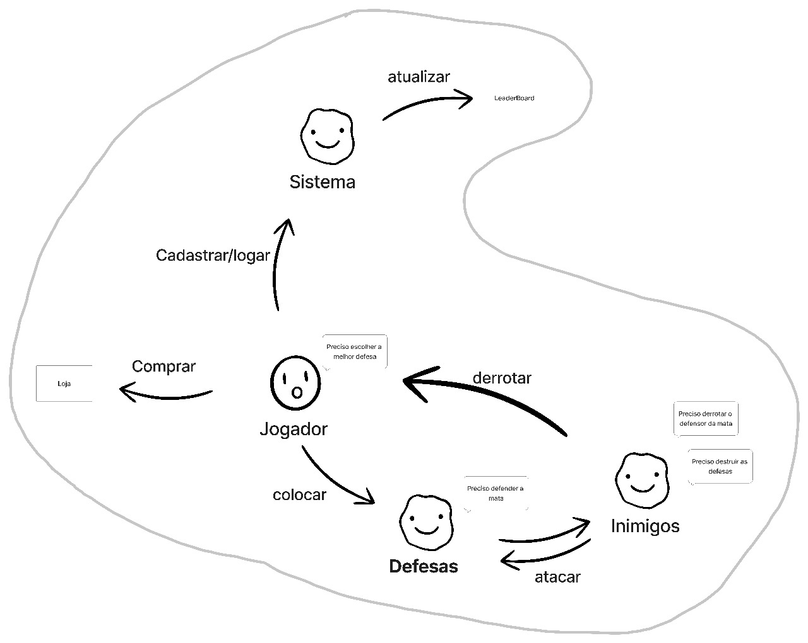

# Rich Picture

## Histórico de revisão

| Data | Versão | Descrição | Autor(es)|
|:----:|:------:|:---------:|:--------:|
|03/09/2025|0.1|Adição de introdução e definição|[Danielle Soares](https://github.com/danielle-soaress)|

## Introdução

O objetivo deste documento é apresentar, de forma visual, a ideia central do nosso sistema por meio de um Rich Picture. Esse artefato, que faz parte do estudo da disciplina de Arquitetura e Desenho de Software, representa as funcionalidades, os atores e as interações do projeto desenvolvido pelo Grupo 5.

## Definição

Rich Picture <a id="TEC1" href="#RP1">^1^</a> é uma técnica visual utilizada na análise de sistemas para representar, de forma livre e informal, a visão geral de um problema, seus atores (quem participa do sistema), operações (o que é feito ou quais ações ocorrem no sistema), armazenamento de dados (onde e como as informações são guardadas), setas (fluxo de informação, comunicação ou influência entre os elementos) e fronteira do sistema (limites do que está sob controle dos desenvolvedores ou do escopo do sistema). Ele é frequentemente usado na fase inicial da modelagem de sistemas.

## Metodologias e Ferramentas

Para a elaboração deste artefato, foi realizado um estudo do ambiente do aplicativo E-Título, com testes e análises de suas funcionalidades. A síntese foi representada por meio de um rich picture, elaborado com a ferramenta Figma, juntamente com sua respectiva legenda.

## Resultados

A seguir, a Figura 1 mostra o Rich Picture final, que foi elaborado a partir da consolidação das ideias individuais de cada membro do grupo. Para a criação desse material, cada integrante do grupo desenvolveu o seu próprio Rich Picture com base nas suas ideias. Posteriormente,essas ideias foram consolidadas em um único Rich Picture que melhor representasse a visão geral do sistema.

As Figuras 2 a 8 apresentam os Rich Pictures individuais que serviram de base para a criação da versão final.

 

<figure style="text-align: center;">
    
    <figcaption>
        

            Figura 1: Rich Picture Final (Fonte: <a href="https://github.com/danielle-soaress">Danielle Soares</a>, 2025)
        

    </figcaption>
</figure>

 

<figure style="text-align: center;">
    
    <figcaption>
        

            Figura 2: Rich Picture Individual (Fonte: <a href="https://github.com/danielle-soaress">Danielle Soares</a>, 2025)
        

    </figcaption>
</figure>

 

<figure style="text-align: center;">
    
    <figcaption>
        

            Figura 1: Rich Picture Individual. (Fonte: <a href="https://github.com/">Danielle Soares</a>, 2025)
        

    </figcaption>
</figure>

 

<figure style="text-align: center;">
    
    <figcaption>
        

            Figura 1: Rich Picture Individual. (Fonte: <a href="https://github.com/danielle-soaress">Danielle Soares</a>, 2025)
        

    </figcaption>
</figure>

<figure style="text-align: center;">
    
    <figcaption>
        

            Figura 1: Rich Picture Individual. (Fonte: <a href="https://github.com/danielle-soaress">Danielle Soares</a>, 2025)
        

    </figcaption>
</figure>

 

<figure style="text-align: center;">
    
    <figcaption>
        

            Figura 1: Rich Picture Individual. (Fonte: <a href="https://github.com/danielle-soaress">Danielle Soares</a>, 2025)
        

    </figcaption>
</figure>

<figure style="text-align: center;">
    
    <figcaption>
        

            Figura 1: Rich Picture Individual. (Fonte: <a href="https://github.com/danielle-soaress">Danielle Soares</a>, 2025)
        

    </figcaption>
</figure>

<figure style="text-align: center;">
    
    <figcaption>
        

            Figura 1: Rich Picture Individual. (Fonte: <a href="https://github.com/danielle-soaress">Danielle Soares</a>, 2025)
        

    </figcaption>
</figure>

<figure style="text-align: center;">
    
    <figcaption>
        

            Figura 1: Rich Picture Individual. (Fonte: <a href="https://github.com/danielle-soaress">Danielle Soares</a>, 2025)
        

    </figcaption>
</figure>

## Referências Bibliográficas

> <a id="RP1" href="#TEC1">1.</a> MONK, Andrew; HOWARD, Steve. The Rich Picture: A Tool for Reasoning About Work Context. 1998.  Disponível em: <<https://ics.uci.edu/~wscacchi/Software-Process/Readings/RichPicture.pdf>>. Acesso em: 12/04/2025.
